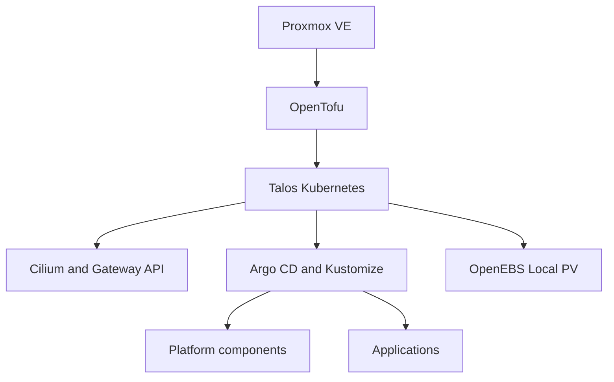

# Kubernetes Homelab GitOps

> Sanitized public reference of a real homelab GitOps environment. The live cluster is reconciled from a separate private repository; this repository is not connected to the production Argo CD instance.

## Overview

This project documents a two-node Proxmox VE homelab running a Talos Linux Kubernetes cluster named `murim`. Infrastructure provisioning and cluster bootstrap are handled with OpenTofu, while workloads and platform components follow a declarative Argo CD and Kustomize workflow.

The cluster topology used for learning and validation consists of one control-plane node and two worker nodes.

## Architecture



### Platform components

- Cilium CNI with kube-proxy replacement, L2 announcements and Gateway API
- Argo CD using the App-of-Apps pattern
- Kustomize bases and environment overlays
- OpenEBS Local PV storage classes
- cert-manager with ACME DNS-01
- ExternalDNS using RFC2136 and TSIG
- Bitnami Sealed Secrets
- Glance dashboard as an example workload

## Repository layout

| Path | Purpose |
| --- | --- |
| `clusters/murim/` | Argo CD Applications that compose the cluster |
| `infrastructure/` | Reusable manifests and Helm values for platform services |
| `apps/` | Application bases and environment overlays |

```text
.
├── apps/
│   └── glance/
│       ├── base/
│       └── overlays/homelab/
├── clusters/
│   └── murim/
│       ├── apps/
│       └── infrastructure/
└── infrastructure/
    ├── argocd/
    ├── certificates/
    ├── dns/
    ├── gateway/
    ├── sealed-secrets/
    └── storage/
```

## GitOps model

The operational environment uses a private repository as its source of truth. Argo CD watches that repository, renders the declared manifests and reconciles them with the cluster. This public repository is a sanitized portfolio copy and is deliberately disconnected from the live cluster.

Changes made here therefore do not trigger synchronization, self-healing or pruning in `murim`.

Application manifests in this public copy reference this repository so the example remains internally consistent.

## Security and sanitization

- Operational domains, private network endpoints and contact addresses were replaced with documentation values.
- Sensitive values are represented as `SealedSecret` ciphertext and are bound to a resource name and namespace.
- The Sealed Secrets controller private key is not stored in this repository.
- Kubeconfigs, Talos configs, OpenTofu state, private keys and plaintext credentials are intentionally excluded.
- The operational repository, cluster credentials and persistent data remain private.

Example values used in this repository:

| Setting | Example |
| --- | --- |
| Internal DNS zone | `home.example.com` |
| DNS server | `192.0.2.53` |
| ACME contact | `acme@example.com` |

## Rendering the manifests

Install Kustomize and render an overlay locally before applying any changes:

```bash
kustomize build apps/glance/overlays/homelab
kustomize build infrastructure/gateway
kustomize build infrastructure/dns/external-dns
```

The repository is an architectural reference rather than a turnkey deployment. Replace all example values, regenerate every SealedSecret for your own cluster and review storage/network assumptions before use.

## Current learning roadmap

- Deploy a metrics and monitoring stack
- Build dashboards and alerts for nodes and workloads
- Add OpenTelemetry-based traces where useful
- Automate load, backup and recovery checks
- Document operational runbooks and incident procedures

## Related project

The Proxmox and Talos provisioning layer is maintained separately with OpenTofu. Its public portfolio version is sanitized independently because state files and provider credentials require a different security boundary.
