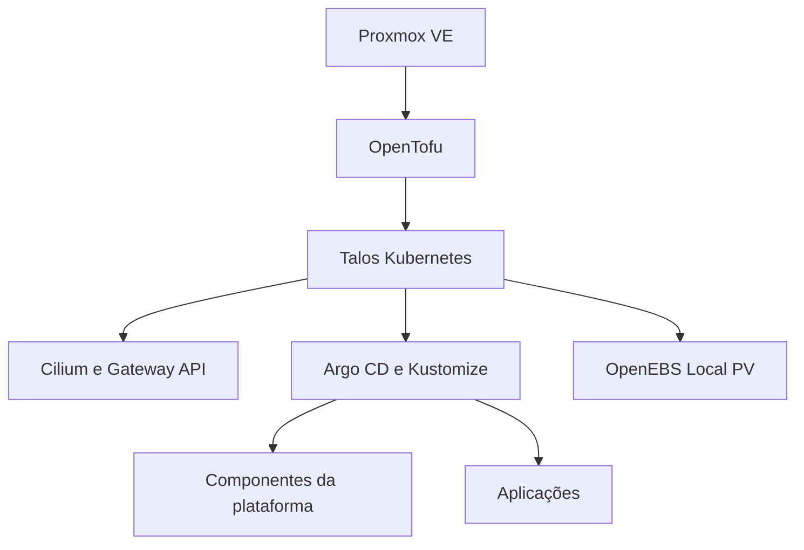

# Homelab Kubernetes com GitOps

**Português** | [English](README.en.md)

> Referência pública e sanitizada de um ambiente GitOps real de homelab. O cluster ativo é reconciliado a partir de outro repositório privado; este repositório não está conectado à instância de produção do Argo CD.

> **Transparência sobre o uso de IA:** ferramentas de inteligência artificial generativa foram utilizadas como apoio na elaboração e organização deste README, na sanitização da cópia pública e na tradução da documentação para o inglês. A responsabilidade pela revisão técnica, pelas decisões e pelo conteúdo publicado permanece com o autor do projeto.

## Visão geral

Este projeto documenta um homelab com dois nós Proxmox VE executando um cluster Kubernetes com Talos Linux chamado `murim`. O provisionamento da infraestrutura e a inicialização do cluster são realizados com OpenTofu, enquanto as cargas de trabalho e os componentes de plataforma seguem um fluxo declarativo com Argo CD e Kustomize.

A topologia do cluster utilizada para aprendizado e validação é composta por um nó de control plane e dois nós workers.

## Arquitetura



### Componentes da plataforma

- Cilium CNI com substituição do kube-proxy, anúncios L2 e Gateway API
- Argo CD utilizando o padrão App-of-Apps
- Bases e overlays de ambiente com Kustomize
- Classes de armazenamento OpenEBS Local PV
- cert-manager com ACME DNS-01
- ExternalDNS utilizando RFC2136 e TSIG
- Bitnami Sealed Secrets
- Dashboard Glance como exemplo de aplicação

## Estrutura do repositório

| Caminho | Finalidade |
| --- | --- |
| `clusters/murim/` | Applications do Argo CD que compõem o cluster |
| `infrastructure/` | Manifests reutilizáveis e valores Helm dos serviços de plataforma |
| `apps/` | Bases de aplicações e overlays de ambiente |

```text
.
├── apps/
│   └── glance/
│       ├── base/
│       └── overlays/homelab/
├── clusters/
│   └── murim/
│       ├── apps/
│       └── infrastructure/
└── infrastructure/
    ├── argocd/
    ├── certificates/
    ├── dns/
    ├── gateway/
    ├── sealed-secrets/
    └── storage/
```

## Modelo GitOps

O ambiente operacional utiliza um repositório privado como fonte da verdade. O Argo CD monitora esse repositório, renderiza os manifests declarados e os reconcilia com o cluster. Este repositório público é uma cópia sanitizada para portfólio e está deliberadamente desconectado do cluster ativo.

Portanto, alterações feitas aqui não acionam sincronização, autorrecuperação ou pruning no cluster `murim`.

Os manifests de aplicações desta cópia pública referenciam este próprio repositório para manter o exemplo internamente consistente.

## Segurança e sanitização

- Domínios operacionais, endpoints da rede privada e endereços de contato foram substituídos por valores de documentação.
- Valores sensíveis são representados como dados cifrados em recursos `SealedSecret`, vinculados a um nome de recurso e namespace.
- A chave privada do controlador Sealed Secrets não é armazenada neste repositório.
- Kubeconfigs, configurações do Talos, estados do OpenTofu, chaves privadas e credenciais em texto aberto são intencionalmente excluídos.
- O repositório operacional, as credenciais do cluster e os dados persistentes permanecem privados.

Valores de exemplo utilizados neste repositório:

| Configuração | Exemplo |
| --- | --- |
| Zona DNS interna | `home.example.com` |
| Servidor DNS | `192.0.2.53` |
| Contato ACME | `acme@example.com` |

## Renderizando os manifests

Instale o Kustomize e renderize localmente um overlay antes de aplicar qualquer alteração:

```bash
kustomize build apps/glance/overlays/homelab
kustomize build infrastructure/gateway
kustomize build infrastructure/dns/external-dns
```

Este repositório é uma referência de arquitetura, não uma implantação pronta para uso. Substitua todos os valores de exemplo, gere novamente cada `SealedSecret` para o seu próprio cluster e revise as premissas de armazenamento e rede antes de utilizá-lo.

## Roteiro atual de aprendizado

- Implantar uma stack de métricas e monitoramento
- Criar dashboards e alertas para nós e cargas de trabalho
- Adicionar traces baseados em OpenTelemetry quando forem úteis
- Automatizar testes de carga, backup e recuperação
- Documentar runbooks operacionais e procedimentos de resposta a incidentes

## Projeto relacionado

A camada de provisionamento do Proxmox e do Talos é mantida separadamente com OpenTofu. Sua versão pública para portfólio é sanitizada de forma independente, pois arquivos de estado e credenciais de providers exigem uma separação de segurança diferente.
